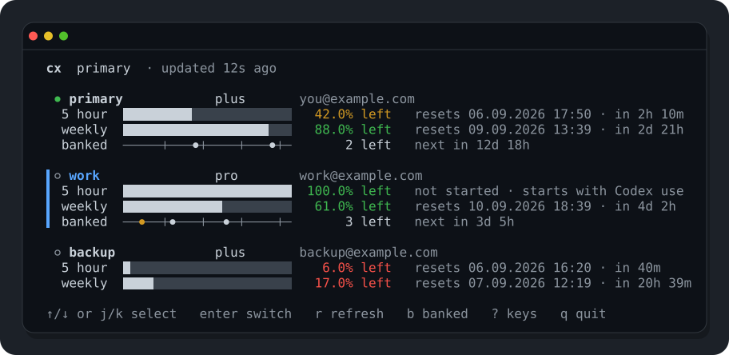

# cx

A small Codex account switcher for macOS and Linux.

Add multiple ChatGPT accounts, switch between them, and see each account's live 5-hour and weekly quotas with reset times — without touching your Codex sessions, history, or config.



## Install

Requires the Codex CLI.

```sh
curl -fsSL https://raw.githubusercontent.com/ecylmz/cx/main/install.sh | sh
```

This installs `cx` to `~/.local/bin`, imports your existing Codex login as an account named `primary` (if you have one), and adds a small shell integration for bash/zsh.

The shell integration matters: without it, a bare `codex` launch can reattach to a local app-server still holding the previously selected account. Add this line to `~/.zshrc` or `~/.bashrc` if the installer didn't:

```sh
eval "$(cx shell-init)"
```

## Use

```sh
cx              # dashboard: pick an account, see quotas
cx add work     # add another account via Codex device auth
cx use work     # switch account
cx auto         # switch only if the current account ran out of quota
```

That's it for daily use. Everything else:

```sh
cx status [NAME] [--json]   # live quota status for every account
cx current                  # show active account
cx list                     # list accounts, no network
cx rename OLD NEW
cx remove NAME
cx relogin NAME             # refresh one account's credential
cx doctor                   # verify files, symlink and shell integration
cx update                   # install latest release
cx version
```

### Adding the right account

If several ChatGPT accounts are signed into your browser, `--expect` is an optional safety check:

```sh
cx add work --expect you@example.com
```

cx verifies the email that device auth actually returned and refuses to save the credential if it doesn't match. It also rejects adding an account that cx already manages under another name.

### Automatic selection

`cx auto` keeps the active account as long as it has both 5-hour and weekly quota left. Once either runs out, it switches to the usable account with the *least* weekly quota remaining — spending the nearly-empty accounts first and keeping the fresh ones in reserve. It exits with status 1 without switching if every account is exhausted.

### Quota windows

Opening the dashboard starts any rolling quota window that hasn't started yet, by sending one minimal Codex request per account. This spends a handful of tokens so your 5-hour and weekly reset countdowns stay active. Accounts with no quota left are shown as `window not started · usage limit reached`. (`cx auto` never does this — it only reads.)

## Build from source

```sh
git clone https://github.com/ecylmz/cx.git
cd cx
CX_BUILD_FROM_SOURCE=1 ./install.sh
```
