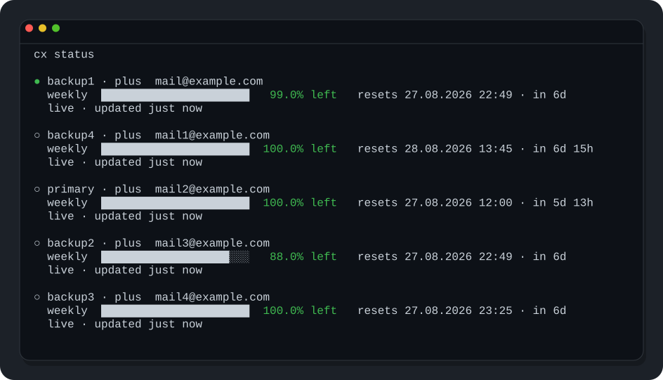

# cx

A small Codex account switcher for macOS and Linux, including Omarchy/Arch and Ubuntu.

`cx` keeps your normal Codex sessions and project state intact while letting you add multiple ChatGPT accounts, switch between them, and see each account's live 5-hour and weekly quotas, reset times, and available banked resets.



## Install

Requires the Codex CLI.

```sh
curl -fsSL https://raw.githubusercontent.com/ecylmz/cx/main/install.sh | sh
```

The installer downloads the latest native release for Apple Silicon/Intel macOS or amd64/arm64 Linux, verifies `SHA256SUMS`, and installs `cx` to `~/.local/bin`. Linux support is distribution-independent; Omarchy/Arch and Ubuntu are tested paths. On macOS the installer also fixes executable permissions and clears the quarantine attribute that can block downloaded binaries.

Omarchy ships Codex as a mise-managed lazy launcher in `~/.local/bin`; `cx` works with that launcher directly, so no separate Codex installation path is required. Omarchy also reserves the shell alias `cx` for Claude Code. When the installer detects that default Omarchy alias, it adds an idempotent override to the end of `~/.bashrc` that removes only the `cx` alias, leaving Omarchy's files untouched so the `cx` binary wins. Open a new shell or run `source ~/.bashrc` after installation. If `cx` was installed on Omarchy before this support was added, rerun the installer once; `cx update` only replaces the binary and does not modify shell configuration.

## Use

```sh
cx add primary
cx add backup
cx
```

The dashboard shows the active account, both the 5-hour and weekly quota remaining, each window's full local reset date/time, and every available banked reset with its expiration time. Cached values appear immediately as `refreshing`, then each account switches to live data as its parallel refresh finishes; the footer shows refresh progress across accounts.

Opening the interactive `cx` dashboard also starts any unused rolling quota window it finds. If either the 5-hour or weekly window is `not started`, `cx` sends one minimal ephemeral Codex request for that account, then refreshes its quota and stores the resulting reset timestamps. The same tiny turn starts both windows when both are unused. Window-start requests run in parallel with a small concurrency limit, so multiple accounts do not serialize unnecessarily. This intentionally consumes a very small amount of Codex quota in exchange for keeping every account's 5-hour and weekly reset countdowns active when the dashboard is opened.

Account switching is verified against the actual `codex` executable on `PATH`. After `cx use NAME`, cx probes Codex's app-server for its effective `codexHome` and current ChatGPT account. If a wrapper or pre-existing Codex installation resolves another home, cx configures that home to use the selected managed `auth.json` too and verifies the account again. If Codex can still be observed using another account, `cx use` fails instead of reporting a false successful switch. `cx doctor` also reports the effective runtime home and account when the installed Codex exposes this information.

```sh
cx                    # dashboard
cx status             # live status for every account
cx use                 # interactive account switch
cx use primary         # switch directly and verify Codex runtime account
cx add backup          # add with device auth
cx relogin backup      # log in again
cx doctor              # verify cx and effective Codex runtime
cx update              # install latest release
cx version
```

`cx update` verifies the release checksum before replacing the current binary.

To build from source:

```sh
git clone https://github.com/ecylmz/cx.git
cd cx
CX_BUILD_FROM_SOURCE=1 ./install.sh
```
